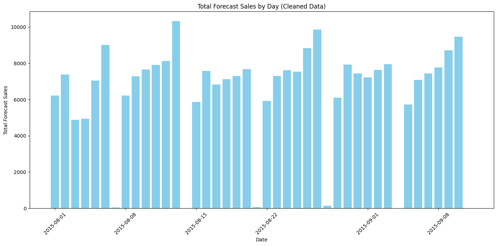
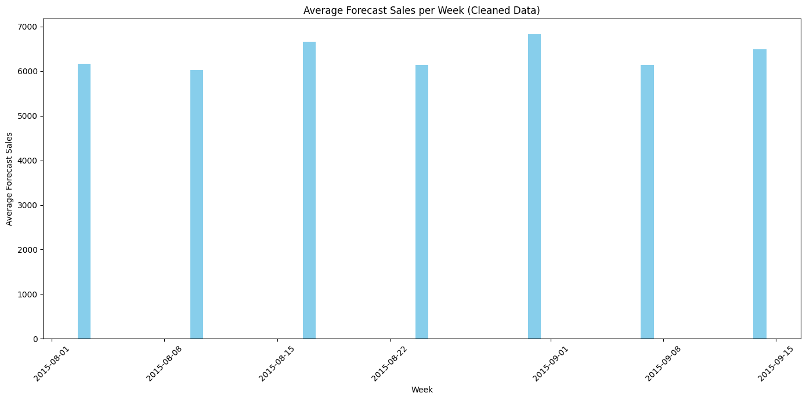

# Sales Data Forecasting for Rossmann Stores

## Project Overview

This project aims to develop a time series forecasting model to predict daily sales for Rossmann stores. By utilizing historical sales data and various store attributes, we seek to create an accurate predictive model that supports business planning and inventory management.

**Project Team:** Kevin Tran, Shameer Razaak, and Juan Mantilla

**Dataset Source:** [Kaggle Rossmann Store Sales Dataset](https://www.kaggle.com/c/rossmann-store-sales/data)

## Objectives

- Retrieve and process sales data from the Rossmann Stores dataset.
- Conduct Exploratory Data Analysis (EDA) to uncover sales trends and patterns.
- Engineer features to enhance the model's predictive accuracy.
- Explore advanced techniques, such as Random Forest to potentially improve performance.
- Develop and optimize a time series forecasting model with a target R-squared score of at least 0.80.
- Document the entire process, from data preprocessing to model evaluation.
- Present findings clearly and engagingly.

## Exploratory Data Analysis (EDA)

EDA focuses on understanding the sales data through various aspects:

- **Sales vs Customers:** Analyzed the relationship between sales and the number of customers.
- **Sales per Day:** Evaluated sales trends daily.
- **Customers per Day:** Investigated daily customer patterns.
- **Sales per Customer:** Assessed average sales per customer.
- **Average Sales per Week:** Reviewed weekly sales trends.
- **Weekday Sales:** Analyzed sales trends by day of the week.
- **Sales Overtime:** Examined sales over 6 weeks.
- **Locality:** Studied the impact of store locality on sales.
- **Seasonality:** Identified seasonal patterns in the sales data.
- **Promotions:** Evaluated the effect of promotions on sales.

## Model Training

1. **Ensure Dependencies are Installed:**
   Install required libraries using:
   ```bash
   pip install numpy pandas matplotlib scikit-learn
   ```

2. **Save the Code:**
   Save the provided code in a Python script file, e.g., `Random_forest.py`.

3. **Run the Script:**
   Execute the script from the command line or an IDE:
   ```bash
   python Random_forest.py
   ```

4. **Understanding the Code:**
   - **Data Loading and Preprocessing:** Normalizes the data.
   - **Feature Creation:** Generates lag features for the Random Forest model.
   - **Training and Evaluation:** Trains the model and assesses performance.
   - **Plotting Results:** Visualizes predictions and saves plots.
   - **Forecasting:** Produces future sales forecasts and saves results.

## Random Forest Overview

**What is Random Forest?**  
Random Forest is a powerful machine learning algorithm combining multiple decision trees' results to enhance predictive accuracy. It is effective for both classification and regression tasks.

**Decision Trees:**  
Decision trees make decisions based on a series of questions, and Random Forest improves their performance by averaging predictions from many such trees.

**Ensemble Methods:**  
Random Forest uses bagging and feature randomness to build an ensemble of uncorrelated decision trees, reducing variance and improving model accuracy.

**How It Works:**  
Involves key hyperparameters like node size, number of trees, and number of features sampled. Predictions are made through averaging (for regression) or majority voting (for classification).

**Benefits:**  
- Reduces overfitting.
- Flexible for various tasks.
- Provides insights into feature importance.

**Challenges:**  
- Time-consuming and resource-intensive.
- Complex interpretation compared to single decision trees.

**Applications:**  
They are used in finance, healthcare, and e-commerce for credit risk evaluation, gene classification, and recommendation engines.

## EDA Graphs generated from the machine learning model's dataset

1. **Total Forecast Sales by Day**  
   
   
2. **Average Forecast Sales per Week**  
   
   
3. **42 Day Sales Forecast**  
   

## Conclusions

- Store type B shows the highest sales and customer traffic.
- Sales correlate strongly with the number of customers.
- Promotions boost sales and customer counts.
- Sales are higher during school holidays compared to other holidays.
- Increased sales during Christmas week.
- Missing values in certain features don’t necessarily indicate lack of competition.
- Slight seasonality observed in sales data.
- Saturdays are popular shopping days.
